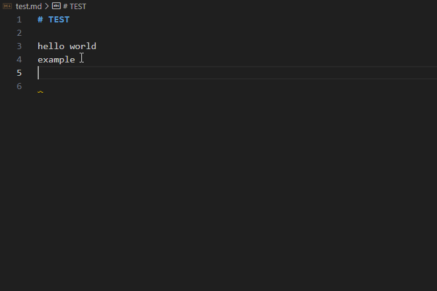
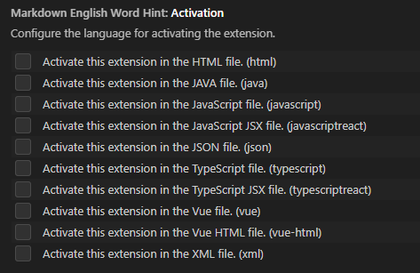

# Markdown English Word Hint

+ Provide English word hint in Markdown file.
+ You can also modify the settings to activate this extension in other types of files.

Because the Markdown code prompt feature is disabled by default, you need to make settings in `settings.json` to enable the extension functionality.

For example:

``` json
"[markdown]": {
  "editor.quickSuggestions": {
    "comments": "on",
    "strings": "on",
    "other": "on"
  }
}
```

## Features

在 `settings.json` 设置开启 Markdown 键入时自动显示建议后，在键入英文字符时提供英语单词建议。

+ Provide English word hint in Markdown file.



词典数据源于 [ECDICT](https://github.com/skywind3000/ECDICT)，根据 `ecdict.csv` 进行处理后得到包含四十万多个单词的字典，数据较大，扩展加载需要一定时间。

## Extension Settings

|   键名称  |   说明    |
| :------: | :-------: |
| MarkdownEnglishWordHint.activation | Configure the language for activating the extension. |



勾选对应选项，重启 VSCode 即可在对应文件中也激活此扩展，在键入英文字符时提供建议。

## Known Issues

+ `vscode.CompletionItem` 按照字符顺序排序（从a到z），无法按照词频排序。
+ 在输入中文/数字时，紧接着输入英文字符不会出现提示（在中文字符/数字中间输入英文字符也不会出现提示）。需要键入一个空格再输入英文字符才会出现提示。
+ 部分单词音标显示错误。

## Release Notes

### 0.1.1

更正996个单词音标错误，将所有单词由多个文件合并到一个文件。

### 0.1.0

Visual Studio Code扩展-Markdown 英语单词提示初版发布。

---
